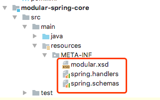

# modular-spring
Spring框架是一把灵活锋利的瑞士军刀，这里通过扩展Spring，实现工程的模块化。

## 模块化
面向对象中的封装是指利用抽象数据类型将数据和基于数据的操作封装在一起，
使其构成一个不可分割的独立实体，数据被保护在抽象数据类型的内部，
尽可能地隐藏内部的细节，只保留一些对外接口使之与外部发生联系

进一步将提供某种服务的代码封装成模块或者组件,隐藏服务的实现细节,对外暴露服务接口,
模块之间通过暴露接口的方式实现交互,不依赖模块的内部结构.

模块化的设计可让开发人员专注于模块本身,提高认知效率.不同的模块可以非常方便的进行集成,
通过组装不同模块使得软件易于裁剪,模块内部结构可自由修改.

## 模块化的方式
1.工程中通过不同的package实现模块化

2.通过依赖注入容器实现模块化

3.通过classLoader单独加载模块实现模块化(OSGI)

第一种方式依赖人工维护模块之间的隔离,难以控制,第三种方式通过classloader做隔离,
但模块之间的调用需要将参数,返回值以及异常做序列化和反序列化,成本比较大,第二种方式
没有类之间的隔离,模块间的调用开销小,但无法解决模块间依赖不兼容的问题
(模块1与模块2依赖了某个jar的不同版本).这里选择使用Spring做模块隔离.

## modular-spring的模块的约定
包含如下两类文件的jar或者子工程被认为是一个模块
* META-INF/module.json(一个模块只能有一个)
* META-INF/spring/xxx.xml(spring配置文件,一个模块可以有多个,命名随意)

module.json文件是对模块的描述,包含模块名,模块依赖的其它模块列表,例如:
```json
{
  "moduleName": "cn.yxffcode.test.coreservice",
  "dependenceModules": ["cn.yxffcode.test.commondal", "cn.yxffcode.test.commonsal"]
}
```
moduleName表示模块名,dependenceModules表示依赖的模块列表,依赖的模块会在此模块之前被加载
spring配置文件与普通spring工程相同

## 服务接口
可以在spring的配置文件中暴露服务接口,例如:
```xml
<?xml version="1.0" encoding="UTF-8"?>
<beans xmlns="http://www.springframework.org/schema/beans"
       xmlns:xsi="http://www.w3.org/2001/XMLSchema-instance"
       xmlns:modular="http://www.yxffcode.cn/modular"
       xsi:schemaLocation="http://www.springframework.org/schema/beans
       http://www.springframework.org/schema/beans/spring-beans.xsd
       http://www.yxffcode.cn/modular http://www.yxffcode.cn/modular.xsd">

  <bean name="testService" class="cn.yxffcode.modularspring.test.TestServiceImpl"/>

  <modular:service ref="testService" interface="cn.yxffcode.modularspring.test.TestService"/>

</beans>
```
modular:service表示服务接口的暴露,意味着此接口能被其它模块所使用

可以在spring的配置文件中引用其它模块暴露的服务,例如:
```xml
<?xml version="1.0" encoding="UTF-8"?>
<beans xmlns="http://www.springframework.org/schema/beans"
       xmlns:xsi="http://www.w3.org/2001/XMLSchema-instance"
       xmlns:modular="http://www.yxffcode.cn/modular"
       xsi:schemaLocation="http://www.springframework.org/schema/beans
       http://www.springframework.org/schema/beans/spring-beans.xsd
       http://www.yxffcode.cn/modular
       http://www.yxffcode.cn/modular.xsd">

  <modular:reference name="testService" interface="cn.yxffcode.modularspring.test.TestService"/>

  <bean class="cn.yxffcode.modularspring.test.TestCoreService" init-method="init">
    <property name="testService" ref="testService"/>
  </bean>
</beans>
```

modular:reference表示引用一个服务,如果此模块对引用的服务有初始化依赖,则需要在module.json文件中配置模块
依赖,即将服务所在的模块名配置到此模块的dependenceModules中.

## 服务引用的自动代理
在开发模块时，如果模块依赖其它模块的服务，而服务尚未实现或服务提供模块尚未集成进来，可以给服务的引用加上代理，让模块
能正常工作，可以使用auto-stub标签打开服务引用自动代理功能。
```xml
<modular:auto-stub/>
```
auto-stub标签在modular:reference的基础上加了一层检查，如果引用的服务不存在，则使用代理对象代替服务对象.
可以通过stub标签定义服务引用代理对象的InvocationHandler。
```xml
<modular:stub interface="cn.yxffcode.modularspring.service.TestStubService"
              invocation-handler="cn.yxffcode.modularspring.test.TestStubInvocationHandler"/>
```
可以使用invocation-handler-ref指定一个bean的name来代替invocation-handler，如果invocation-handler和
invocation-handler-ref都没有指定，则使用默认stub，默认stub将所有的方法调用都返回null。
## 注解
### 发布服务
可使用@ModularService发布服务,使用ModularService标记的bean会被spring托管,并作为模块的服务发布,例如:
```java
package cn.yxffcode.modularspring.service;

import cn.yxffcode.modularspring.core.annotation.ModularService;

/**
 * @author gaohang on 7/2/17.
 */
@ModularService
public class TestServiceImpl implements TestService {
  public void test() {
    System.out.println("test service dal");
  }
}
```
### 引用服务
不同模块之间通过服务接口交互,可使用@ModularReference引用其它模块的服务,例如:
```java
package cn.yxffcode.modularspring.test;

import cn.yxffcode.modularspring.core.annotation.ModularReference;
import cn.yxffcode.modularspring.service.TestService;
import org.springframework.beans.factory.InitializingBean;
import org.springframework.stereotype.Service;

/**
 * @author gaohang on 7/7/17.
 */
@Service
public class TestCoreService implements InitializingBean {

  @ModularReference
  private TestService testService;

  public void init() {
    testService.test();
  }

  public TestService getTestService() {
    return testService;
  }

  public void setTestService(TestService testService) {
    this.testService = testService;
  }

  public void afterPropertiesSet() throws Exception {
    init();
  }
}
```
### 使用context:component-scan
因为框架没有对各模块做classloader的隔离,为了防止当前模块扫描到其它模块里的bean,需要修改配置:
```xml
<context:component-scan base-package="cn.yxffcode.modularspring">
    <context:exclude-filter type="custom" expression="cn.yxffcode.modularspring.boot.spring.ModuleTypeFilter"/>
</context:component-scan>
```
### 使用modular:component-scan
待实现
## 模块加载的前置处理和后置处理
通过ModuleLoadListener接口可以对模块加载做前置处理或者后置处理,例如想要在模块加载前向模块中添加某些Bean,
可以在ModuleLoadListener中对spring注册BeanDefinitionRegistryPostProcessor:
```java
package cn.yxffcode.modularspring.service;

import cn.yxffcode.modularspring.boot.ModuleConfig;
import cn.yxffcode.modularspring.boot.listener.ModuleLoadListener;
import cn.yxffcode.modularspring.core.context.ModuleApplicationContext;
import org.springframework.beans.BeansException;
import org.springframework.beans.factory.config.ConfigurableListableBeanFactory;
import org.springframework.beans.factory.support.BeanDefinitionRegistry;
import org.springframework.beans.factory.support.BeanDefinitionRegistryPostProcessor;

/**
 * @author gaohang on 7/9/17.
 */
public class PostFactoryBeanModuleLoadListener implements ModuleLoadListener {

  public void beforeModuleLoad(ModuleConfig moduleConfig, ModuleApplicationContext applicationContext) {
    applicationContext.addBeanFactoryPostProcessor(new BeanDefinitionRegistryPostProcessor() {
      public void postProcessBeanDefinitionRegistry(BeanDefinitionRegistry registry) throws BeansException {
        //do something
      }

      public void postProcessBeanFactory(ConfigurableListableBeanFactory beanFactory) throws BeansException {
        //do something
      }
    });
  }

  public void afterModuleLoad(ModuleConfig moduleConfig, ModuleApplicationContext applicationContext) {

  }
}
```

## 扩展点接口
有时候,一个模块中需要使用的接口的实现不由此模块决定,比如数据访问模块需要使用DataSource,而DataSource由集成此模块的系统主模块决定.
需要通过一种扩展机制,将数据源注入到模块中,在modular-spring中支持扩展点接口,可以将一个接口声明为扩展点,在其它模块中声明接口的实现bean来达到扩展的目的.
例如声明数据源为扩展点:
```xml
<modular:extension name="dataSource" interface="javax.sql.DataSource"/>
```
在系统主模块中,提供扩展点提实现:
```xml
  <bean name="dataSource" class="org.springframework.jdbc.datasource.DriverManagerDataSource"/>
  <modular:extension-point extension-name="dataSource" ref="dataSource"/>
```
## springmvc对controller的模块化
在web.xml中配置servlet
```xml
<servlet>
    <servlet-name>web</servlet-name>
    <servlet-class>cn.yxffcode.modularspring.webmvc.ModularDispatcherServlet</servlet-class>
    <init-param>
        <param-name>webModuleNamePrefix</param-name>
        <param-value>cn.yxffcode.test.web</param-value>
    </init-param>
    <load-on-startup>1</load-on-startup>
</servlet>
<servlet-mapping>
    <servlet-name>web</servlet-name>
    <url-pattern>*.json</url-pattern>
</servlet-mapping>
```
约定名词模块的simpleName：假如controller所在的模块名为cn.xxx.web.home，
cn.xxx.web是在ModularDispatcherServlet中配置的webModuleNamePrefix,则模块的simpleName是home

配置后，controller可以在不同的模块中，参数webModuleNamePrefix表示所有controller的模块名的共同前缀,
请求的url和视图渲染会有一定的变化，url会自动加上模块的simpleName，例如:
```java
@RequestMapping("/")
@Controller
public class HomeController {

  @ModularReference
  private TestService testService;

  @RequestMapping(value = "index", method = RequestMethod.GET)
  public String index() {
    return "index.html";
  }
}
```
则index的正确访问方式是/home/index.json，而返回的"index.html"的路径是/home/index.html

## 模块化工程结构参考

## 实现细节
### 如何做到按照模块加载

#### 按模块获取spring配置
在初始化每个模块的Spring时，需要保证每个模块只加载此模块自己的spring配置，那么创建Spring
依赖注入容器的步骤应该是：

* 获取META-INF/spring/目录下的所有xml文件
* 通过上一步中获取的xml文件

在modular-spring中，各模块之间通过Spring的ApplicationContext做隔离，但ClassLoader
没有隔离。因为模块中的spring配置文件不需要（也不能）通过配置的方式指定，所以加载时需要识别
出类路径下哪些配置属于一个模块，因此，在初始化spring时，不能通过spring提供的ResourceLoader
加载spring配置，因为ResourceLoader会将类路径下所有spring的配置取出，而Resource名都是
以META-INF/spring开头，无法区分出每个模块的配置，可以使用ClassLoader遍历类路径，通过路径
来判断哪些配置属于同一个模块：
```java
private void scanDirectory(
          File directory, ClassLoader classloader, String packagePrefix,
          ImmutableSet<File> ancestors, Predicate<String> accepter) throws IOException {
    File canonical = directory.getCanonicalFile();
    if (ancestors.contains(canonical)) {
      // A cycle in the filesystem, for example due to a symbolic link.
      return;
    }
    File[] files = directory.listFiles();
    if (files == null) {
      logger.warn("Cannot read directory {}", directory);
      // IO error, just skip the directory
      return;
    }
    ImmutableSet<File> newAncestors = ImmutableSet.<File>builder()
            .addAll(ancestors)
            .add(canonical)
            .build();
    for (File f : files) {
      String name = f.getName();
      if (f.isDirectory()) {
        scanDirectory(f, classloader, packagePrefix + name + "/", newAncestors, accepter);
      } else {
        String resourceName = packagePrefix + name;
        if (!resourceName.equals(JarFile.MANIFEST_NAME) && accepter.apply(resourceName)) {
          resources.add(ResourceInfo.of("file:" + f.getAbsolutePath(), classloader));
        }
      }
    }
  }

  private void scanJar(File file, ClassLoader classloader, Predicate<String> acceptor) throws IOException {
    JarFile jarFile;
    try {
      jarFile = new JarFile(file);
    } catch (IOException e) {
      // Not a jar file
      return;
    }
    try {
      for (URI uri : getClassPathFromManifest(file, jarFile.getManifest())) {
        scan(uri, classloader, acceptor);
      }
      Enumeration<JarEntry> entries = jarFile.entries();
      while (entries.hasMoreElements()) {
        JarEntry entry = entries.nextElement();
        if (entry.isDirectory() || entry.getName().equals(JarFile.MANIFEST_NAME)) {
          continue;
        }
        if (acceptor.apply(entry.getName())) {
          resources.add(ResourceInfo.of("jar:" + jarFile.getName() + "!/" + entry.getName(), classloader));
        }
      }
    } finally {
      try {
        jarFile.close();
      } catch (IOException ignored) {
      }
    }
  }
```
详细代码见ClasspathScanner类。

#### 按模块初始化Spring
获取到每个模块的spring配置后，按照每个模块加载配置，创建ApplicationContext对象。
但是获取到的spring配置有以下两种存在形式：
* 存在于一个目录中，比如在本地运行测试代码时，工程目录下的配置
* 存在于jar包中，模块部署前会被打成jar

对于这两种形式的配置，读取的方式不一样，可扩展spring的AbstractXmlApplicationContext
来读取不同存在形式的配置，例如读取目录中的配置：
```java
public class ModuleFileSystemApplicationContext extends AbstractModuleApplicationContext {
  @Override
  protected Resource getResourceByPath(String path) {
    if (path != null && path.startsWith("/")) {
      path = path.substring(1);
    }
    return new FileSystemResource(path);
  }
}
```
读取jar中的配置创建ApplicationContext
```java
public class ModuleJarEntryXmlApplicationContext extends AbstractModuleApplicationContext {
  @Override
  protected Resource getResourceByPath(String path) {
    return new JarEntryResource(path);
  }
}
```
AbstractXmlApplicationContext的作用后文再提.

### 模块加载的勾子

#### 为什么需要勾子
框架本身不可能满足所有场景，想要做到不修改框架本身的代码也能满足很多特征需求，可以提供
勾子在框架的核心流程中做拦截操作。例如mybatis的拦截器，spring的PostBeanProcessor。
#### modular-spring中的勾子接口
modular-spring提供了以下两个勾子接口:
```java
public interface ModuleLoadListener {

  /**
   * 在调用{@link ModuleApplicationContext#refresh()}前调用
   */
  void beforeModuleLoad(ModuleConfig moduleConfig, ModuleApplicationContext applicationContext);

  /**
   * 在调用{@link ModuleApplicationContext#refresh()}后调用
   */
  void afterModuleLoad(ModuleConfig moduleConfig, ModuleApplicationContext applicationContext);
}

```
```java
public interface ApplicationStartupCallback {
  void action();
}
```
ModuleLoadListener提供了在一个模块初始化前和初始化后的处理逻辑的调用能力，而ApplicationStartupCallback提供了应用启动后的回调能力。
### 如何实现模块中的服务接口的发布与引用
#### 基本思想
因为模块之间的ApplicationContext之间相互隔离，所以一个模块发布的服务不能被直接注入
到另一个模块的bean中，面服务的发布入引用的模块之间可能无依赖关系，这意味着服务引用方
初始化时，服务发布方可能还没有初始化，所以需要在服务引用方使用代理来达到目的。

如何使用代理达到跨模块之间的服务引用呢？通过modular:service标签在spring中配置的服务
接口会被一个全局的ServiceManager托管，而通过modular:reference标签在spring中配置
的服务引用会通过动态代理创建一个代理对象，并被spring注入到需要使用此服务的bean中，初始
时代理对象中的目标对象（即服务提供对象）是null，当第一次在代理方法上执行方法调用时，代理
对象会从ServiceManager中获取服务提供对象

#### modular命名空间的xml配置的实现方式
spring支持自定义命名空间，每个命名空间对应一个xsd文件和一个NamespaceHandler，如果
需要自定义命名空间则需要按照spring的规范提供xsd文件和NamespaceHandler的实现。例如
modular-spring-core中的自定义标签实现：



* modular.xds文件中是对modular:service和modular:reference标签的定义
* spring.handlers中是命名空间和NamespaceHandler之间的对应关系
* spring.schemas中是命名空间对应的xds文件路径与实际路径之间的关系

spring.handlers中的内容：
```properties
http\://www.yxffcode.cn/modular=cn.yxffcode.modularspring.core.config.ModularNamespaceHandler
```
spring.schemas中的内容:
```properties
http\://www.yxffcode.cn/modular.xsd=META-INF/modular.xsd
```

说完了spring对自定义xmlns的支持，再来看看具体的标签解析.

在Spring中，一个bean会被装配成一个BeanDefinition对象，BeanDefinition对象是对一个bean
的描述，包括bean的类型，bean的依赖等。而xmlns中，一个标签对应BeanDefinitionParser，用于
向Spring中注册BeanDefinition对象。BeanDefinitionParser对象通过NamespaceHandler注册。
例如ModularNamespaceHandler:
```java
public class ModularNamespaceHandler extends NamespaceHandlerSupport {
  @Override
  public void init() {
    registerBeanDefinitionParser("service", new ServiceBeanDefinitionParser());
    registerBeanDefinitionParser("reference", new ReferenceBeanDefinitionParser());
    registerBeanDefinitionParser("extension", new ExtensionBeanDefinitionParser());
    registerBeanDefinitionParser("extension-point", new ExtensionPointBeanDefinitionParser());
  }
}
```
具体的BeanDefinition对象的注册逻辑可以看看上面的几个BeanDefinitionParser的实现类。

#### 服务的发布与引用的实现
modular:service标签会向spring中注册一个ServiceBean对象，ServiceBean的部分代码如下:
```java
public class ServiceBean implements ApplicationContextAware {
  private String ref;
  private String interfaceName;
  private String uniqueId;
  private ApplicationContext applicationContext;

  public ServiceBean(String beanRef, String interfaceName, String uniqueId) {
    this.interfaceName = interfaceName;
    this.uniqueId = Strings.nullToEmpty(uniqueId);
    this.ref = beanRef;
  }

  @Override
  public void setApplicationContext(ApplicationContext applicationContext) throws BeansException {
    this.applicationContext = applicationContext;
    ServiceManager.registryService(this);
  }
}
```
可以看到，在模块的Spring初始化后，会向ServiceManager中注册一个ServiceBean

modular:reference标签则是通过向spring注册一个代理来实现服务的引用，部分代码如下:
```java
public final class ServiceReference implements FactoryBean<Object> {
  private final Class<?> targetClass;
  private final String uniqueId;

  public ServiceReference(Class<?> targetClass, String uniqueId) {
    this.targetClass = targetClass;
    this.uniqueId = Strings.nullToEmpty(uniqueId);
  }

  @Override
  public Object getObject() throws Exception {
    return Reflection.newProxy(targetClass, new AbstractInvocationHandler() {
      private Object delegate;

      private void initDelegate() {
        final ServiceBean service = ServiceManager.getService(targetClass.getName(), uniqueId);
        if (service == null) {
          throw new ServiceLocatingException("服务 " + targetClass + " 没有找到,请检查是否是模块依赖不正确");
        }
        final ApplicationContext ctx = service.getApplicationContext();
        this.delegate = ctx.getBean(service.getRef());
      }

      @Override
      protected Object handleInvocation(Object proxy, Method method, Object[] args) throws Throwable {
        if (delegate == null) {
          synchronized (this) {
            if (delegate == null) {
              initDelegate();
            }
          }
        }
        return method.invoke(delegate, args);
      }
    });
  }
}

```
ServiceReference是一个FactoryBean，Spring在初始化服务引用对象时，会调用ServiceReference.getObject()
方法获取一个动态代理对象，可以看到在代理对象上第一次调用方法时会从ServiceManager中获取真实的服务对象。
### 如何实现注解方式的服务发布与引用
在`如何实现模块中的服务接口的发布与引用`中讲述了通过自定义xmlns的方式支持发布与引用服务，
以注解的形式发布与引用服务重用了`如何实现模块中的服务接口的发布与引用`中提到的ServiceBean
和ServiceReference这两个类，只不过注册到spring中的方式发生了变化.

#### 注解配置bean与注入依赖对象的原理与实践
使用过spring的都知道context:component-scan标签可以让spring支持通过注解的方式配置，常用
的注解有@Component, @Service, @Repository等，那么spring如何实现注解的注入呢？可以通过
ContextNamespaceHandler找到，spring通过ClassPathBeanDefinitionScanner,ClassPathBeanDefinitionScanner
类会扫描标记了@Component的类，同时如果一个类上面标记了使用@Component作为元注解的注解，则此
类也会被注册到spring中，例如@Service注解的源码：
```java
@Target({ElementType.TYPE})
@Retention(RetentionPolicy.RUNTIME)
@Documented
@Component
public @interface Service {
	String value() default "";
}
```
可以看到@Service被@Component标记了。那么，可以实现注解@ModularService：
```java
@Target({ElementType.TYPE})
@Retention(RetentionPolicy.RUNTIME)
@Documented
@Component
public @interface ModularService {
  String value() default "";

  Class<?> interfaceClass() default Object.class;
}

```
则使用@ModularService标记的类也会被注册到Spring中，但是还有一个问题，只配置了bean还不够，
还需要向Spring中注册ServiceBean来暴露服务，回过头来看看AbstractModuleApplicationContext
的实现（此处为部分代码，完整代码可打开类文件查看）：
```java
abstract class AbstractModuleApplicationContext extends AbstractXmlApplicationContext implements ModuleApplicationContext {
  @Override
  protected final void loadBeanDefinitions(DefaultListableBeanFactory beanFactory) throws BeansException, IOException {
    // Create a new XmlBeanDefinitionReader for the given BeanFactory.
    final XmlBeanDefinitionReader beanDefinitionReader = new XmlBeanDefinitionReader(new ModularBeanDefinitionRegistry(beanFactory));

    beanDefinitionReader.setEnvironment(this.getEnvironment());
    beanDefinitionReader.setResourceLoader(this);
    beanDefinitionReader.setEntityResolver(new ResourceEntityResolver(this));

    initBeanDefinitionReader(beanDefinitionReader);
    loadBeanDefinitions(beanDefinitionReader);
  }
}
```
可以看到，在读取xml时使用了ModularBeanDefinitionRegistry类，此类的作用则是处理@ModularService的服务暴露和@ModularReference的服务引用:
```java

  private void registerServiceBeanIfNeed(String beanName, Class<?> beanClass) {
    final ModularService modularService = beanClass.getDeclaredAnnotation(ModularService.class);
    if (modularService != null) {
      Class<?> serviceInterface = modularService.interfaceClass();
      if (serviceInterface == null || serviceInterface == Object.class) {
        final Class<?>[] interfaces = beanClass.getInterfaces();
        if (ArrayUtils.isEmpty(interfaces)) {
          throw new BeanDefinitionStoreException("服务定义出错",
                  new ServiceDeclarationException("modular service定义异常,bean 没有实现接口,bean的类型:" + serviceInterface.getName()));
        }
        serviceInterface = interfaces[0];
      }
      final String uniqueId = modularService.uniqueId();
      final RootBeanDefinition rootBeanDefinition = ModularBeanUtils.buildServiceBean(beanName, serviceInterface.getName(), uniqueId);
      delegate.registerBeanDefinition(beanNameGenerator.generateBeanName(rootBeanDefinition, delegate), rootBeanDefinition);
    }
  }

  private void registerServiceReferenceIfNeed(Class<?> beanClass) {
    final Field[] declaredFields = beanClass.getDeclaredFields();
    if (ArrayUtils.isEmpty(declaredFields)) {
      return;
    }

    for (Field field : declaredFields) {
      final ModularReference modularReference = field.getDeclaredAnnotation(ModularReference.class);
      if (modularReference == null) {
        continue;
      }
      final Class<?> type = field.getType();
      final String referenceBeanName = getReferenceBeanName(type);
      if (delegate.containsBeanDefinition(referenceBeanName)) {
        continue;
      }
      final RootBeanDefinition rootBeanDefinition = ModularBeanUtils.buildReferenceBean(type, modularReference.uniqueId());
      delegate.registerBeanDefinition(referenceBeanName, rootBeanDefinition);
    }
  }

```
通过反射获取@ModularService和@ModularReference，并注册,具体见代码文件。但是这里还有一个问题，
如何对标记了@ModularReference的属性实现@Autowired的自动注入的功能呢，这里需要先了解一下@Autowired
的实现原理：

`Spring提供了初始化过程中的各种勾子，可以达到很多自定义功能的目的，比如BeanPostProcessor, BeanFactoryPostProcessor等，
而@Autowired注解是由AutowiredAnnotationBeanPostProcessor处理，它是Spring的勾子的一个实现，对于@ModularReference的
自动注入，我这里为了方便以后对@ModularReference的定制化，实现了ModularReferenceInjectProcessor`

ModularReferenceInjectProcessor目前非常简单，没有任何逻辑，后继对@ModularReference做功能加强时会增加其它逻辑:
```java
public class ModularReferenceInjectProcessor extends AutowiredAnnotationBeanPostProcessor {
  public ModularReferenceInjectProcessor() {
    super();
    setAutowiredAnnotationType(ModularReference.class);
  }
}
```
然后回到上面的ModularBeanDefinitionRegistry类的构造器:
```java
  public ModularBeanDefinitionRegistry(BeanDefinitionRegistry delegate) {
    this.delegate = checkNotNull(delegate);
    final RootBeanDefinition rootBeanDefinition = new RootBeanDefinition(ModularReferenceInjectProcessor.class);
    delegate.registerBeanDefinition(ModularBeanDefinitionRegistry.class.getName(), rootBeanDefinition);
  }
```
将ModularReferenceInjectProcessor注册到Spring中即可。
### 对springmvc的支持
#### 需要解决的问题
需要解决的问题主要是url的mapping，例如用户请求/home/xxx/index.json，因为web模块中，
Controller不感知web模块名，需要框架自动将请求路由到home这个web模块中的的Controller上。
#### 定制HandlerMapping
Spring通过HandlerMapping来决定Controller中的每个方法对应的请求url，modular-spring-webmvc
实现了ModuleRequestMappingHandlerMapping，用于自动将Controller的RequestMapping前
加上模块名，核心代码:
```java
  protected RequestMappingInfo getMappingForMethod(Method method, Class<?> handlerType, String webModuleSimpleName) {
    final RequestMappingInfo requestMappingInfo = createRequestMappingInfo(new ModuleRequestMapping(webModuleSimpleName), null);
    return requestMappingInfo.combine(super.getMappingForMethod(method, handlerType));
  }
```
这里用到了注解的本质：注解就是接口，@interface就是interface。
```java
class ModuleRequestMapping implements RequestMapping {
  @Override
  public Class<? extends Annotation> annotationType() {
    return RequestMapping.class;
  }
}
```
上面是ModuleRequestMapping的核心代码，具体代码见代码文件。ModuleRequestMapping实现了
RequestMapping这个注解，而真正起作用的是initHandlerMethods方法，会将每个web模块中的
Controller与url关联上:
```java
protected final void initHandlerMethods() {
  if (logger.isDebugEnabled()) {
    logger.debug("Looking for request mappings in application context: " + getApplicationContext());
  }

  final String[] beanNames = getBeanNames(getApplicationContext());

  for (String beanName : beanNames) {
    if (!beanName.startsWith(SCOPED_TARGET_NAME_PREFIX) &&
        isHandler(getApplicationContext().getType(beanName))) {
      detectHandlerMethods(beanName);
    } else {
      final Class<?> type = getApplicationContext().getType(beanName);
      if (!ApplicationContext.class.isAssignableFrom(type)) {
        continue;
      }
      final ApplicationContext ctx = getApplicationContext().getBean(beanName, ApplicationContext.class);
      currentApplicationContext = ctx;
      final String[] moduleBeanNames = getBeanNames(ctx);
      for (String moduleBeanName : moduleBeanNames) {
        if (!beanName.startsWith(SCOPED_TARGET_NAME_PREFIX) &&
            isHandler(ctx.getType(moduleBeanName))) {
          detectHandlerMethods(moduleBeanName, beanName);
        }
      }
      currentApplicationContext = null;
    }
  }
  handlerMethodsInitialized(getHandlerMethods());
}
```
#### 定制DispatcherServlet
有了HandlerMapping后，还需要定制DispatcherServlet。

因为原始的DispatcherServlet需要一个WebApplicationContext，但按照模块加载后，每个web模块
都有一个WebApplicationContext，所以这里需要为DispatcherServlet实现一个facade来管理每个
web模块的ApplicationContext。

ModularDispatcherServlet类扩展自DispatcherServlet,并通过GenericWebApplicationContext
管理每个web模块的ApplicationContext，核心代码:
```java
private static class WebModuleRegistryListener implements ModuleLoadListener {
    private final WebModulePredicate webModulePredicate;
    private final GenericWebApplicationContext wac;
    private final WebApplicationContext commonApplicationContext;

    public WebModuleRegistryListener(WebModulePredicate webModulePredicate, GenericWebApplicationContext wac,
                                     WebApplicationContext commonApplicationContext) {
      this.commonApplicationContext = commonApplicationContext;
      this.webModulePredicate = webModulePredicate;
      this.wac = wac;
    }

    @Override
    public void beforeModuleLoad(ModuleConfig moduleConfig, ModuleApplicationContext applicationContext) {
      if (!webModulePredicate.apply(moduleConfig)) {
        return;
      }
      if (commonApplicationContext != null) {
        applicationContext.setParent(commonApplicationContext);
      }
    }

    @Override
    public void afterModuleLoad(ModuleConfig moduleConfig, ModuleApplicationContext applicationContext) {
      if (!webModulePredicate.apply(moduleConfig)) {
        return;
      }
      final String moduleName = moduleConfig.getModuleName();
      final int i = moduleName.lastIndexOf('.');
      final String contextBeanName = i < 0 ? moduleName : moduleName.substring(i + 1);
      if (StringUtils.isBlank(contextBeanName)) {
        throw new IllegalStateException("web模块的模块名不合法, 模块名:" + moduleName);
      }
      final RootBeanDefinition rootBeanDefinition = new RootBeanDefinition();
      rootBeanDefinition.setBeanClass(ModuleApplicationContextBean.class);
      rootBeanDefinition.getConstructorArgumentValues().addIndexedArgumentValue(0, applicationContext);
      wac.registerBeanDefinition(contextBeanName, rootBeanDefinition);
    }
  }
```
这里使用到了前文提到的ModuleLoadListener